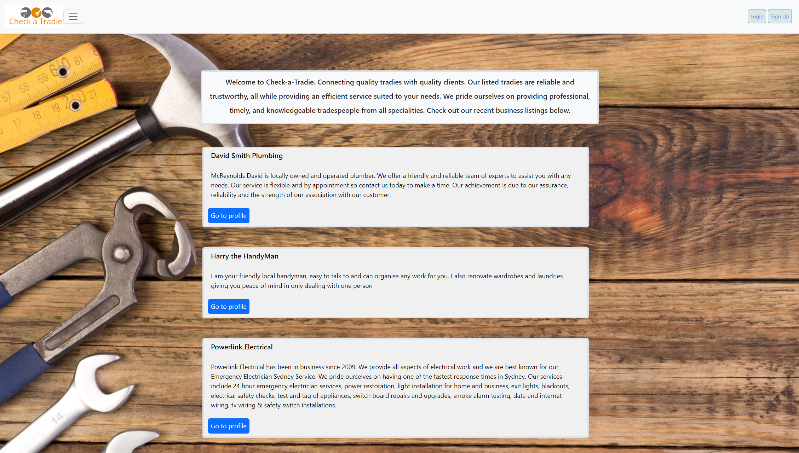
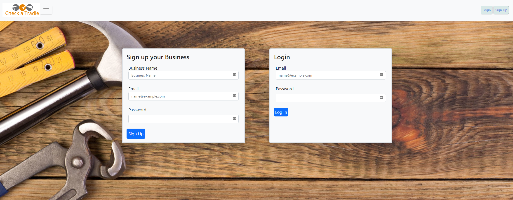

# Check-A-Tradie

### By Mackenzie Gray, Grace Brown, Tanel Colak and Andrei Bondaret

## Technologies Used 

- Node.js/Express.js to create a RESTful API
- MySQL Database with Sequelize ORM for the database
- Handlebars.js as the template engine
- Javascript, CSS and Bootstrap framework for the styling and interaction between elements of the front-end 
- npm packages such as bcrypt, connect-session-sequelize, dotenv, express-session, validator
- Heroku for application hosting

## Description

Our motivation for Check-A-Tradie was to create a full stack application to combine a back-end consisting of a server, database, API and user authentication, and connect it to an intuitive front-end. Our project allows a tradesperson looking for work to display their services, skills and certification so that a consumer can browse a list of options for a service they need completing. 

A business owner can sign up and register their business, edit their dashboard and profile to showcase what they offer. Our application also allows consumers to be able to browse the selection of businesses and select one based on the job they require to be completed.  

## Usage and Installation

Installation of npm packages required are invoked with the following command:

`npm i`

Data is seeded by invoking the following command:

`node seeds/seed.js`

The application server will be invoked with the following command:

`node server.js`

## Link to deployed Heroku Application
[Click here](https://pacific-waters-66801.herokuapp.com/)

## Screenshots

